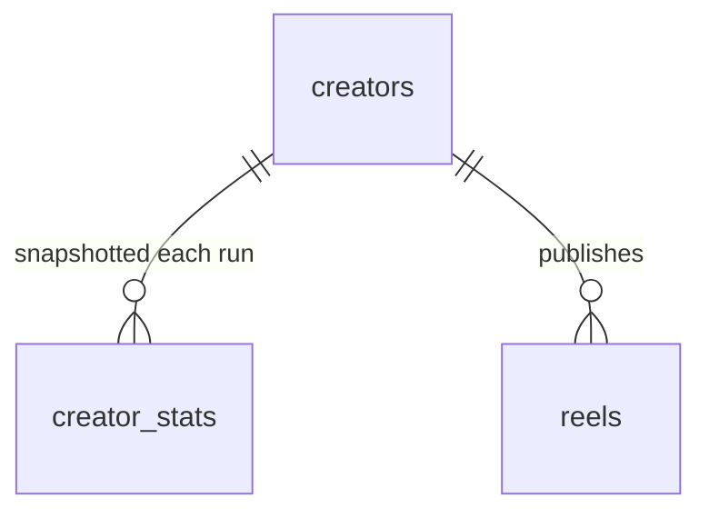

# Content Store Schema (v1)

The Content Store is a single SQLite database at `data/content.db` (gitignored). This is the source of truth (ADR-0001); the dashboard and CLI both read it, and the pipeline upserts into it idempotently (ADR-0004).

The model is normalized into three tables: **`creators`** (identity), **`creator_stats`** (a time-series of creator stats), and **`reels`** (one row per Reel). Creator data is *not* duplicated onto Reel rows. Accessed via `better-sqlite3`, server-side only (ADR-0005).



Two classes of column behave differently (ADR-0004):
- **Metrics** (and the derived metrics computed from them) are **refreshed every run**; each run also appends a new `creator_stats` snapshot.
- **Analysis** columns are **written once and immutable**, recomputed only when the producing prompt's content hash changes (see `build-spec.md`).

## Table: `creators`

One row per tracked Creator — identity only. Mutable stats live in `creator_stats`.

| Column | Type | Notes |
|---|---|---|
| `username` | TEXT PK | Lowercased, no `@`. |
| `full_name` | TEXT | |
| `biography` | TEXT | |
| `is_verified` | INTEGER (0/1) | |
| `profile_url` | TEXT | `https://www.instagram.com/<username>/`. |
| `first_seen_at` | TEXT | ISO-8601 UTC — when we first added them. |
| `last_scraped_at` | TEXT | Convenience: timestamp of the most recent snapshot. |

## Table: `creator_stats`

A **time-series** of a creator's stats — one row appended per refresh run. This is the "single place to track creator stats over time" (e.g. follower growth).

| Column | Type | Notes |
|---|---|---|
| `id` | INTEGER PK | Autoincrement surrogate. |
| `creator_username` | TEXT NOT NULL | FK → `creators(username)`. |
| `captured_at` | TEXT NOT NULL | ISO-8601 UTC. |
| `followers` | INTEGER | |
| `following` | INTEGER | |
| `posts_count` | INTEGER | |

`UNIQUE(creator_username, captured_at)`. The **latest snapshot** is the row with `max(captured_at)` for that creator. Append-only — never updated in place (that's the whole point of keeping history).

## Table: `reels`

| Column | Type | Class | Notes |
|---|---|---|---|
| `shortcode` | TEXT PK | identity | Instagram shortcode; globally unique. |
| `url` | TEXT NOT NULL | identity | Canonical `https://www.instagram.com/reel/<shortcode>/`. Traceability back to the original (hard requirement). |
| `creator_username` | TEXT NOT NULL | identity | FK → `creators(username)`. |
| `caption` | TEXT | metadata | |
| `posted_at` | TEXT | metadata | ISO-8601 UTC. Drives the 90-day window + newest-first ordering. |
| `duration_sec` | REAL | metadata | Nullable. |
| `thumbnail_path` | TEXT | metadata | Local `data/thumbnails/<shortcode>.jpg` (the only media we keep). |
| `top_comments` | TEXT (JSON) | metadata | Capped array (shape below). Stored for future use. |
| `likes` | INTEGER | metric | Raw scraped value, **normalized: Apify's `-1` (likes hidden) is stored as `NULL`** — never `-1`. |
| `comments_count` | INTEGER | metric | |
| `views` | INTEGER | metric | `videoPlayCount` / `videoViewCount`. |
| `shares` | INTEGER | metric | **Best-effort, usually `NULL`.** |
| `last_scraped_at` | TEXT | metric | ISO-8601 UTC of the last metrics refresh. |
| `performance_score` | REAL | derived | `likes + 3·comments_count + 0.1·views`. See null rule. |
| `engagement_rate` | REAL | derived | `performance_score / followers` (followers = creator's latest snapshot). |
| `is_viral` | INTEGER (0/1) | derived | `1` when `likes ≥ 5 × followers` (latest snapshot). See null rule. |
| `is_outlier` | INTEGER (0/1) | derived | `1` when `engagement_rate >` this creator's mean + 2σ. Creator-relative. |
| `transcript` | TEXT | analysis | Verbatim, from `prompts/transcription.md`. |
| `topic` | TEXT | analysis | Free-form (the per-Reel signal you browse). |
| `category` | TEXT | analysis | One slug from `config/categories.yaml`. |
| `hook_technique` | TEXT | analysis | One slug from the framework hook taxonomy. |
| `beat_sequence` | TEXT (JSON) | analysis | Ordered beats with approx timing (shape below). |
| `why_it_works` | TEXT | analysis | Free-form 2–3 sentences. |
| `analysis_status` | TEXT | analysis | `pending` \| `analyzed` \| `failed` \| `skipped`. |
| `analysis_error` | TEXT | analysis | Last error if `failed`. |
| `analyzed_at` | TEXT | analysis | ISO-8601 UTC when analysis was written. |
| `transcription_prompt_hash` | TEXT | provenance | Content hash of the transcription prompt that produced `transcript`. |
| `analysis_prompt_hash` | TEXT | provenance | Content hash of the (config-injected) analysis prompt that produced the analysis fields. |

> **Saves are intentionally absent** — not scrapable for another account's content. Don't add a `saves` column that would only ever be `NULL`.
>
> **Followers are intentionally absent from `reels`** — they live in `creator_stats`. Derived metrics that need a follower count read the creator's latest snapshot at compute time; the dashboard joins `reels → creators → latest creator_stats` to display "X likes vs Y followers".

### Derived-metric computation & null rule

Derived metrics are recomputed every refresh from the Reel's metrics and the creator's **latest `creator_stats.followers`** (captured in the same run). They must not silently corrupt when inputs are missing:

- If `likes IS NULL` (hidden): `performance_score`, `engagement_rate`, `is_viral` are all `NULL`, and the Reel is **excluded from the outlier baseline**.
- If the latest `followers` is `NULL` or `0`: `engagement_rate` and `is_viral` are `NULL`; `performance_score` is still computed (it doesn't need followers).
- The dashboard renders `NULL` derived metrics as "—" / "n/a" and sorts them last.

## JSON shapes

### `beat_sequence` (beats carry approximate timing + their verbatim transcript slice)

Ordered array; each beat is a label from the framework beat vocabulary, its approximate position as a percentage of total duration, and `text` — the verbatim transcript words spoken during that beat:

```json
[
  { "label": "HOOK",    "start_pct": 0,  "end_pct": 8,   "text": "Claude just announced something I'm genuinely so excited about." },
  { "label": "CONTEXT", "start_pct": 8,  "end_pct": 20,  "text": "Artifacts are now available in Claude Code, which means…" },
  { "label": "VALUE_1", "start_pct": 20, "end_pct": 55,  "text": "…" },
  { "label": "PAYOFF",  "start_pct": 55, "end_pct": 85,  "text": "…" },
  { "label": "CTA",     "start_pct": 85, "end_pct": 100, "text": "Follow for more." }
]
```

Labels: `HOOK, CONTEXT, VALUE_1, VALUE_2, VALUE_3, TENSION, PAYOFF, ESCALATION, CTA, LOOP_BRIDGE` (see `references/content-strategy-framework.md` §2). `start_pct`/`end_pct` are Gemini's approximate estimates. `text` is the transcript segmented along beat boundaries — best-effort (`""` for a speechless beat); the flat `reels.transcript` column stays canonical and is **not** reconstructed from these slices. Beats stored before `text` was added simply lack the key (decoded as `""`) until a prompt-hash re-analysis backfills them.

### `top_comments`

```json
[
  { "username": "someone", "text": "this is so helpful", "likes": 12 }
]
```

Capped at whatever `apify/instagram-scraper` returns inline (its `latestComments`); no separate comment-scraper call (v1 decision).

## Indexes

- `reels`: `creator_username`, `posted_at`, `performance_score`, `is_viral` — the dashboard's sort/filter axes.
- `creator_stats`: `(creator_username, captured_at)` — latest-snapshot lookups and time-series charts.
