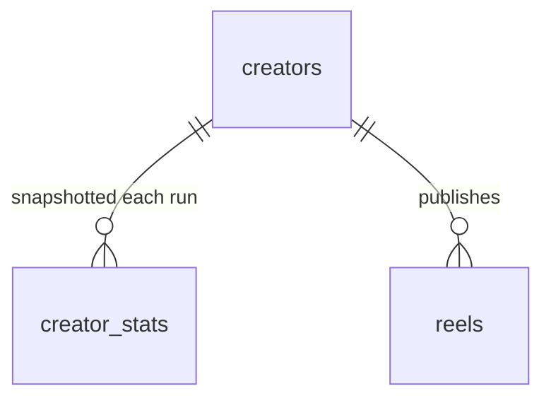

# Content Store Schema (v1)

The Content Store is a single SQLite database at `data/content.db` (gitignored). This is the source of truth (ADR-0001); the dashboard and CLI both read it, and the pipeline upserts into it idempotently (ADR-0004).

The model is normalized into three tables: **`creators`** (identity), **`creator_stats`** (a time-series of creator stats), and **`reels`** (one row per Reel). Creator data is *not* duplicated onto Reel rows. Accessed via `better-sqlite3`, server-side only (ADR-0005).



Two classes of column behave differently (ADR-0004):
- **Metrics** (and the derived metrics computed from them) are **refreshed every run**; each run also appends a new `creator_stats` snapshot.
- **Analysis** columns are **written once and immutable**, recomputed only when the producing prompt's content hash changes (see `build-spec.md`).

## Table: `creators`

One row per tracked Creator — identity only. Mutable stats live in `creator_stats`.

| Column | Type | Notes |
|---|---|---|
| `username` | TEXT PK | Lowercased, no `@`. |
| `full_name` | TEXT | |
| `biography` | TEXT | |
| `is_verified` | INTEGER (0/1) | |
| `profile_url` | TEXT | `https://www.instagram.com/<username>/`. |
| `first_seen_at` | TEXT | ISO-8601 UTC — when we first added them. |
| `last_scraped_at` | TEXT | Convenience: timestamp of the most recent snapshot. |

## Table: `creator_stats`

A **time-series** of a creator's stats — one row appended per refresh run. This is the "single place to track creator stats over time" (e.g. follower growth).

| Column | Type | Notes |
|---|---|---|
| `id` | INTEGER PK | Autoincrement surrogate. |
| `creator_username` | TEXT NOT NULL | FK → `creators(username)`. |
| `captured_at` | TEXT NOT NULL | ISO-8601 UTC. |
| `followers` | INTEGER | |
| `following` | INTEGER | |
| `posts_count` | INTEGER | |

`UNIQUE(creator_username, captured_at)`. The **latest snapshot** is the row with `max(captured_at)` for that creator. Append-only — never updated in place (that's the whole point of keeping history).

## Table: `reels`

| Column | Type | Class | Notes |
|---|---|---|---|
| `shortcode` | TEXT PK | identity | Instagram shortcode; globally unique. |
| `url` | TEXT NOT NULL | identity | Canonical `https://www.instagram.com/reel/<shortcode>/`. Traceability back to the original (hard requirement). |
| `creator_username` | TEXT NOT NULL | identity | FK → `creators(username)`. |
| `caption` | TEXT | metadata | |
| `posted_at` | TEXT | metadata | ISO-8601 UTC. Drives the 90-day window + newest-first ordering. |
| `duration_sec` | REAL | metadata | Nullable. |
| `thumbnail_path` | TEXT | metadata | Local `data/thumbnails/<shortcode>.jpg` (the only media we keep). |
| `top_comments` | TEXT (JSON) | metadata | Capped array (shape below). Stored for future use. |
| `likes` | INTEGER | metric | Raw scraped value, **normalized: Apify's `-1` (likes hidden) is stored as `NULL`** — never `-1`. |
| `comments_count` | INTEGER | metric | |
| `views` | INTEGER | metric | `videoPlayCount` / `videoViewCount`. |
| `shares` | INTEGER | metric | **Best-effort, usually `NULL`.** |
| `last_scraped_at` | TEXT | metric | ISO-8601 UTC of the last metrics refresh. |
| `performance_score` | REAL | derived | `likes + 3·comments_count + 0.1·views`. See null rule. |
| `engagement_rate` | REAL | derived | `performance_score / followers` (followers = creator's latest snapshot). |
| `is_viral` | INTEGER (0/1) | derived | `1` when `likes ≥ 5 × followers` (latest snapshot). See null rule. |
| `is_outlier` | INTEGER (0/1) | derived | `1` when `engagement_rate >` this creator's mean + 2σ. Creator-relative. |
| `transcript` | TEXT | analysis | Verbatim, from `prompts/transcription.md`. |
| `topic` | TEXT | analysis | Free-form (the per-Reel signal you browse). |
| `category` | TEXT | analysis | One slug from `config/categories.yaml`. |
| `hook_technique` | TEXT | analysis | One slug from the framework hook taxonomy. |
| `beat_sequence` | TEXT (JSON) | analysis | Ordered beats with approx timing (shape below). |
| `why_it_works` | TEXT | analysis | Free-form 2–3 sentences. |
| `trigger_keyword` | TEXT | analysis | The Reel's **Trigger Keyword** — the ManyChat CTA word viewers comment to fire a DM automation. Derived during analysis, normalized (lowercase/trim), `NULL` when none. Editing the analysis prompt to emit it changes the rendered prompt → bumps `analysis_prompt_hash` → one re-analysis (ADR-0003). Drives `comments.is_trigger`. |
| `analysis_status` | TEXT | analysis | `pending` \| `analyzed` \| `failed` \| `skipped`. |
| `analysis_error` | TEXT | analysis | Last error if `failed`. |
| `analyzed_at` | TEXT | analysis | ISO-8601 UTC when analysis was written. |
| `transcription_prompt_hash` | TEXT | provenance | Content hash of the transcription prompt that produced `transcript`. |
| `analysis_prompt_hash` | TEXT | provenance | Content hash of the (config-injected) analysis prompt that produced the analysis fields. |
| `faq_prompt_hash` | TEXT | provenance | Content hash of the rendered FAQ-extraction prompt (`prompts/faq-extraction.md`) that produced the Reel's FAQs. Drives the FAQ re-run predicate (ADR-0007): editing the FAQ prompt bumps the hash → one re-extraction. Distinct from `analysis_prompt_hash`: the FAQ leg is independent of video analysis. |
| `faqs_generated_at` | TEXT | provenance | ISO-8601 UTC of the last FAQ run. Also the "Comments re-pulled since the last FAQ run?" anchor: when `max(comments.first_seen_at)` for the Reel is newer than this, FAQs are re-extracted (ADR-0007 — FAQ's mutable input). `NULL` until the first FAQ run. |
| `is_favorite` | INTEGER (0/1) NOT NULL DEFAULT 0 | user state | The user's **Favorite** flag (ADR-0006) — the first mutable, user-authored column. Set/cleared from the dashboard via `PATCH /api/reels/{shortcode}` (`setFavorite`), **never produced or clobbered by a pipeline run**. Drives the library's "Favorites only" filter (`listReels({ favoritesOnly: true })`). |
| `favorited_at` | TEXT | user state | ISO-8601 UTC stamped when favorited, cleared (`NULL`) when unfavorited. Moves in lockstep with `is_favorite`. |
| `is_archived` | INTEGER (0/1) NOT NULL DEFAULT 0 | user state | The user's **Archive** flag (ADR-0006, slice 967) — the second mutable, user-authored column. Set/cleared via `PATCH /api/reels/{shortcode}` (`setArchived`), **never produced or clobbered by a pipeline run**. **Archived Reels are hidden by default everywhere in the library** — `listReels` excludes `is_archived = 1` unless `includeArchived: true`. **Archive wins over favorite**: an archived favorite stays hidden unless `includeArchived` (the favorites filter composes only within the visible, non-archived scope). The dashboard load path passes `includeArchived: true` so the client holds the full set and applies the hide / "Show archived" toggle locally. |
| `archived_at` | TEXT | user state | ISO-8601 UTC stamped when archived, cleared (`NULL`) when unarchived. Moves in lockstep with `is_archived`. |

> **Saves are intentionally absent** — not scrapable for another account's content. Don't add a `saves` column that would only ever be `NULL`.
>
> **Followers are intentionally absent from `reels`** — they live in `creator_stats`. Derived metrics that need a follower count read the creator's latest snapshot at compute time; the dashboard joins `reels → creators → latest creator_stats` to display "X likes vs Y followers".

### Derived-metric computation & null rule

Derived metrics are recomputed every refresh from the Reel's metrics and the creator's **latest `creator_stats.followers`** (captured in the same run). They must not silently corrupt when inputs are missing:

- If `likes IS NULL` (hidden): `performance_score`, `engagement_rate`, `is_viral` are all `NULL`, and the Reel is **excluded from the outlier baseline**.
- If the latest `followers` is `NULL` or `0`: `engagement_rate` and `is_viral` are `NULL`; `performance_score` is still computed (it doesn't need followers).
- The dashboard renders `NULL` derived metrics as "—" / "n/a" and sorts them last.

## JSON shapes

### `beat_sequence` (beats carry approximate timing + their verbatim transcript slice)

Ordered array; each beat is a label from the framework beat vocabulary, its approximate position as a percentage of total duration, and `text` — the verbatim transcript words spoken during that beat:

```json
[
  { "label": "HOOK",    "start_pct": 0,  "end_pct": 8,   "text": "Claude just announced something I'm genuinely so excited about." },
  { "label": "CONTEXT", "start_pct": 8,  "end_pct": 20,  "text": "Artifacts are now available in Claude Code, which means…" },
  { "label": "VALUE_1", "start_pct": 20, "end_pct": 55,  "text": "…" },
  { "label": "PAYOFF",  "start_pct": 55, "end_pct": 85,  "text": "…" },
  { "label": "CTA",     "start_pct": 85, "end_pct": 100, "text": "Follow for more." }
]
```

Labels: `HOOK, CONTEXT, VALUE_1, VALUE_2, VALUE_3, TENSION, PAYOFF, ESCALATION, CTA, LOOP_BRIDGE` (see `references/content-strategy-framework.md` §2). `start_pct`/`end_pct` are Gemini's approximate estimates. `text` is the transcript segmented along beat boundaries — best-effort (`""` for a speechless beat); the flat `reels.transcript` column stays canonical and is **not** reconstructed from these slices. Beats stored before `text` was added simply lack the key (decoded as `""`) until a prompt-hash re-analysis backfills them.

### `top_comments`

```json
[
  { "username": "someone", "text": "this is so helpful", "likes": 12 }
]
```

The thin inline snapshot `apify/instagram-scraper` returns alongside each post (its `latestComments`). Retained, but **superseded for display + FAQ mining by the dedicated `comments` corpus** below (MAIN-966) — `top_comments` is no longer the read path for the detail view.

## Table: `comments`

The dedicated, **accumulating** Comment corpus (ADR-0007): one row per Instagram comment, scraped during `analyze` (up to `comments_per_reel` per Reel, newest + top-liked) and **upserted by `comment_id`** so repeated scrapes grow the union rather than clobbering it. This is the corpus FAQ mining (slice 968) reads from — distinct from the thin inline `reels.top_comments` JSON and from `reels.comments_count` (the raw metric).

| Column | Type | Notes |
|---|---|---|
| `comment_id` | TEXT PK | Instagram's native comment id (mapped from the actor's `id` / `pk` / `commentId`). The dedup key. |
| `shortcode` | TEXT NOT NULL | FK → `reels(shortcode)`. |
| `username` | TEXT | Comment author handle. |
| `text` | TEXT | Comment body. |
| `likes` | INTEGER | Comment like count (nullable). |
| `posted_at` | TEXT | ISO-8601 UTC, best-effort from the actor. |
| `first_seen_at` | TEXT | ISO-8601 UTC — set on first insert and **never clobbered** on re-scrape (the corpus's accumulation anchor). |
| `is_trigger` | INTEGER (0/1) NOT NULL DEFAULT 0 | Flags a Trigger-Keyword (ManyChat) comment. Set by `flagTriggerComments(shortcode, keyword)` (slice 968) — EXACT match against the Reel's `trigger_keyword`: the normalized comment equals the keyword, or is a short (≤3-word) comment whose tokens include it. Recomputed non-destructively (UPDATE, never a write-time delete) so it works when the keyword arrives after a comment scrape. Preserved on conflict so a re-scrape never resets it. Default-view comments exclude `is_trigger = 1`; their count is a CTA-response signal. |

On conflict the mutable fields (`username` / `text` / `likes` / `posted_at`) refresh to the newest pull; `first_seen_at` and `is_trigger` are preserved.

## Table: `faqs`

One row per canonical **FAQ** mined from a Reel's non-trigger Comments (MAIN-969 / ADR-0007). The model (Claude, via `AnthropicPort.extractFaqs`) clusters many phrasings of the same ask into one `question`; the support metrics are **computed from the real `faq_comments` links and snapshotted here** — never an LLM-claimed number. `faqs` + `faq_comments` are **wholesale-replaced together per FAQ run** (`replaceFaqs`); the `comments` table is **never mutated** by a FAQ run.

| Column | Type | Notes |
|---|---|---|
| `id` | INTEGER PK | Autoincrement surrogate. |
| `shortcode` | TEXT NOT NULL | FK → `reels(shortcode)`. |
| `question` | TEXT NOT NULL | The canonical clustered question. |
| `support_count` | INTEGER NOT NULL | `COUNT` of linked Comments (`faq_comments` rows for this FAQ). |
| `support_likes` | INTEGER NOT NULL | `SUM` of the linked Comments' `likes` (NULL likes count as `0`). |
| `strength_score` | REAL NOT NULL | Deterministic demand score: `support_count + ln(1 + support_likes)` (`= support_count + Math.log1p(support_likes)`). A damped likes contribution so a few highly-liked askers can't dominate a broadly-asked question. The dashboard ranks FAQs by this DESC. |

## Table: `faq_comments`

The join linking a FAQ to its **real supporting Comments** (MAIN-969). The example Comments shown in the detail view are queried **live** through this join — the comment text is never duplicated onto the FAQ row. Rebuilt wholesale alongside `faqs` each FAQ run.

| Column | Type | Notes |
|---|---|---|
| `faq_id` | INTEGER NOT NULL | FK → `faqs(id)` `ON DELETE CASCADE` (so re-running FAQs cleans the join). |
| `comment_id` | TEXT NOT NULL | FK → `comments(comment_id)`. |

`PRIMARY KEY (faq_id, comment_id)`. Only ids that map back from **valid, in-range** model indices are inserted (out-of-range indices are dropped in `faqs.ts` before persistence) — so no hallucinated links.

## Table: `drafts`

The user-owned **Draft** — the "your version" of a Reel (MAIN-971 / MAIN-972 / ADR-0006 / ADR-0008). **One row per Reel** (`shortcode` PK/FK), **no history**: regenerating is a destructive full-replace of every generated field (`hooks` / `beat_scripts` / `reasoning` / `caption`). Categorically **user-state** like `is_favorite` / `is_archived` — **no pipeline run produces or clobbers it**; it's written only through the standalone draft route (the read-write mutation seam, not the run registry): `POST /api/reels/{shortcode}/draft` **generates/regenerates** it (Claude, `AnthropicPort.generateDraft`, Sonnet `settings.draft_model`, seeded from the Reel's immutable analysis + its FAQs + original caption), and `PUT /api/reels/{shortcode}/draft` **persists the user's hand-edits** (MAIN-972 — `Store.saveDraft`, UPDATE-only: 404 when no Draft exists). Both write paths run the SAME shape validation/repair in `draft.ts` (3 hooks/one suggested, beat_scripts re-aligned to the analyzed beats), so neither a malformed model response nor a hand-edit can persist a wrong structure.

| Column | Type | Notes |
|---|---|---|
| `shortcode` | TEXT PK | FK → `reels(shortcode)`. One Draft per Reel. |
| `hooks` | TEXT (JSON) | Array of `{text, suggested}` — **exactly 3 options, exactly one `suggested: true`** (forced in `draft.ts`). |
| `beat_scripts` | TEXT (JSON) | Array of `{label, script}` — per-beat talking-points scripts **aligned 1:1 to the Reel's analyzed beat sequence** (same labels/order); **empty `[]` when the Reel has no analyzed beats** (the Draft never invents structure). |
| `reasoning` | TEXT NOT NULL | Free text; references which FAQs were baked into the rewrite. |
| `caption` | TEXT NOT NULL | The **generated** caption (a generated field, **not** a copy of the Reel's original). |
| `generated_at` | TEXT NOT NULL | ISO-8601 UTC — first generation. **Preserved** on regenerate AND on a hand-edit save. |
| `updated_at` | TEXT NOT NULL | ISO-8601 UTC — last (re)generation **or hand-edit save**. Bumped on every write. |

On conflict (regenerate, `upsertDraft`) the generated fields + `updated_at` refresh; `generated_at` is preserved. A hand-edit save (`saveDraft`, MAIN-972) is the same shape — it UPDATEs the four editable fields + bumps `updated_at`, preserving `generated_at` — but is **UPDATE-only** (never inserts): saving when no Draft exists is a no-op the route maps to 404 (there's nothing to edit).

## Indexes

- `reels`: `creator_username`, `posted_at`, `performance_score`, `is_viral` — the dashboard's sort/filter axes.
- `creator_stats`: `(creator_username, captured_at)` — latest-snapshot lookups and time-series charts.
- `comments`: `shortcode` — per-Reel corpus lookups (display + FAQ mining).
- `faqs`: `shortcode` — per-Reel FAQ lookups (detail view).
- `faq_comments`: `faq_id` — live example-Comment lookups through the join.
